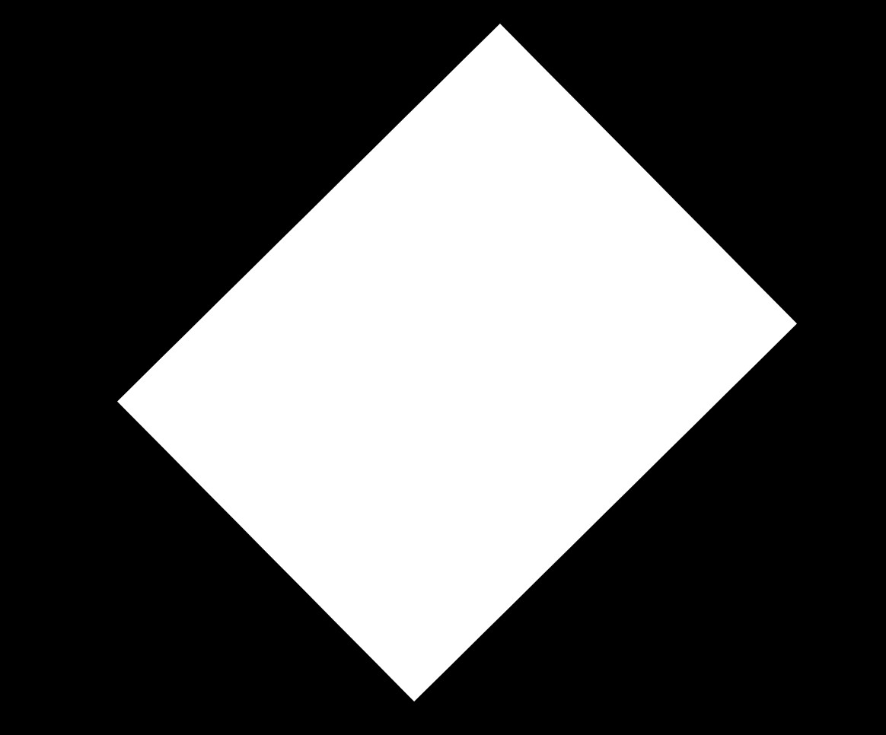
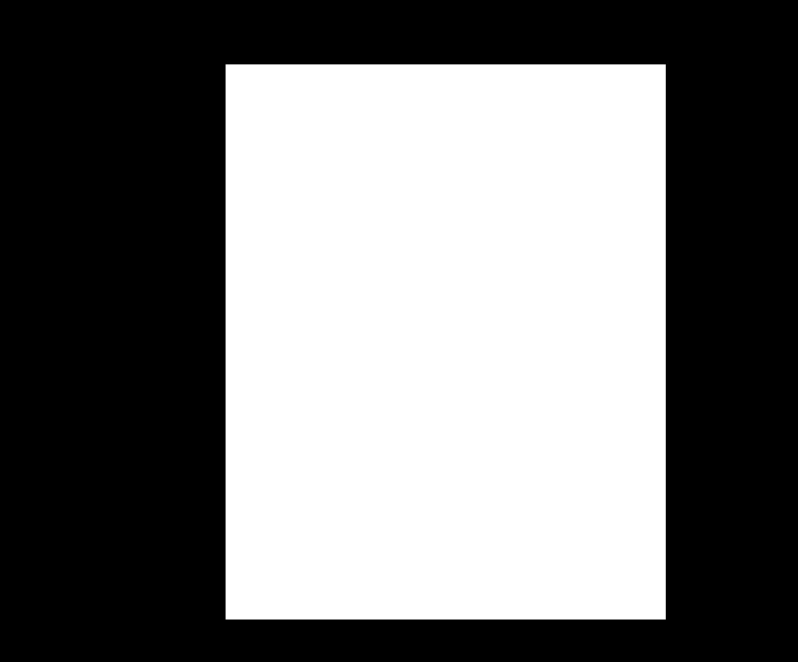
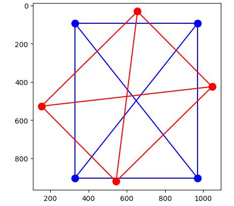
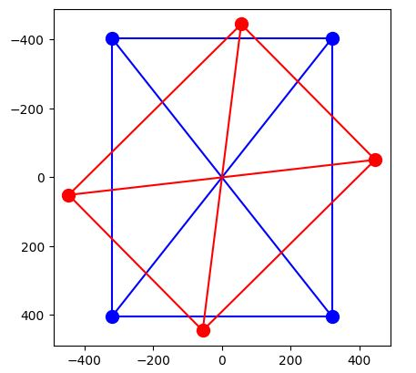
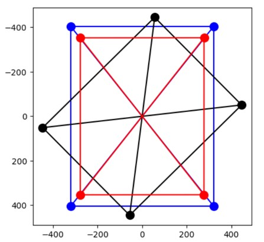

# Kabsch-Umeyama Algorithm for Image Alignment
### Ean J Maloney

## Abstract
The Kabsch-Umeyama Algorithm uses modified singular value decomposition to rotationally align n-dimensional point clouds. This project seeks to implement this alogrithm for aligning images of documents and provides examples of aplications of this technique.

## Introduction
Given two sets of points, A and B, in j dimensions and each with cardinality i, we can express A and B as matrices of the form 

[[x11, x12, ..., x1j],  
[x21, x22, ..., x2j],  
...,  
[xi1, xi2, ..., xij]].

The Kabsch-Umeyama algorithm is a simple algorithm for constructing a rotation matrix R, such that the RMS distance between the respective points of A and B is minimized. Equivalently, this is the matrix R that minimizes the Frobenius norm of A - BR under the constraint that R must be a rotation matrix. In two dimensions, this is a matrix of the form

[[cos($\theta$), sin($\theta$)],  
[-sin($\theta$), cos($\theta$)]].[^1]

One practical application of this algorithm for image processing when the central object in an image has a standard shape and it is necessary to align these objects as closely as possible relative to one another. Specifically, we consider the scenario where we are given images of documents, where each document has a similar rectangular shape, but where they may be rotated relative to the borders of the image. For clarity of expression, we will use the term "aligned boundaries" to refer to cases where the document is "correctly" rotated relative to the image boundaries, "skew boundaries" to refer to cases other than these (see the following examples).

*skew boundaries - image A*

*aligned boundaries - image B*

The intuitive way of converting this geometric situation into a vector problem is to represent the images by the coordinates of their corners in the xy-plane, which will be defined relative to the borders of the images as in the following image.[^2] 

*images A and B translated into points with connecting edges*

We can then express each document object using the matrix form described above, where i = 4 (number of corners) and j = 2 (number of dimensions), and apply the algorithm to get the transformation matrix which rotates the document with skew boundaries into the one with aligned boundaries.

Mathematically, the intuition behind the algorithm can be hinted at given the following considerations. The algorithm uses the SVD of a matrix M to construct a rotation that aligns A to B. The use of SVD is not surprising given that the matrices U and VT can be interpreted as rotations which are applied by multiplying a vector by M. Equally intuitive is the reason for replacing the singular value matrix S by the identity matrix (or by diag(1, 1, ..., -1) in some cases) since the singular value matrix represents scaling of vectors applied by multiplying by M. Since we only want the rotation, the Kabsch-Umeyama Algorithm uses U and VT and a diagonal matrix with entries +1/-1 to build the desired matrix R.

## Detailed Method
Prior to implementing the Kabsch-Umeyama Algorithm, we need to align the centroids of the two documents to the origin. This translation is obviously needed to get the best alignment, irrespective of later rotations. This is done for each object simply by subtracting the mean value over each dimension from the actual values. 

*coordinates of A and B with aligned centroids*

Letting A and B be the matrix representations of the skew and aligned documents, respectively, the algorithm then proceeds according to the following steps.

Kabsch-Umeyama Algorithm
1. Compute the 2x2 matrix: H = ATB.
2. Fing the singular value decomposition of H, which gives U, S, V such that H = USVT.
3. Let $\hat{S}$ = I if det(V) * det(U) $\geq$ 0, else S' = diag(1, -1).
4. Return 2x2 rotation matrix: R = U $\hat{S}$ VT.[^3] 

Multiplying A by R rotates A to give the following, where the black rectangle is A before rotation, the red rectangle is AR and the blue rectangle is B:

## Accomplishments
The example above shows how to rotate the corners of a skew document A into an aligned document B, but, as can be seen in the notebook found in this repo, the algorithm can be applied to align documents with arbitrary angles of skew. Although the examples only align the corners of dummy black and white images, the method can be easily extended to real images by the following steps.

1. Apply a binary filter over the matrix representation of an image, i.e., grayscale the image and give the points which are near white a value of 1 and all the others the value 0. Assuming the document (or at least its corners) are closer to white than the background of the image, the corners can be located by an algorithm similar to the one in the notebook which can be found in this repo. 
2. The angle of rotation which was applied to the corners by R can be found using the vector rotation equation: cos($\theta$) = <u, v>/(|u||v|), where u is the ith row of A, and v is the ith row of AR. This angle of rotation can then be applied to the entire document.

## Observations and Conclusions
The Kabsch-Umeyama Algorithm can be implemented effectively for processing images of documents or other orientable objects, but requires adjustments in certain scenarios.

In one case I found that applying the algorithm to rotate one set of points into another did not actually minimize the norm of B - AR. It aligned the corners of A and B, but the corners of A were not aligned to the correct corners of B. When we apply reflections across the x and y axis to AR, a much lower value of the objective function is obtained. I hypothesize that the reason for this is that different initial orientations of two documents can require different or derings of the rows of A and B to produce the correct result. Because of the low dimensional nature of this particular application, this can be fixed without large cost by simply iterating through the 24 possible row-permutations of A and finding the permutation such that norm B - RA is minimized. For more details see the notebook. 

Umeyama noted that earlier solutions to the minimization problem which is solved by the algorithm resulted in solutions which were reflections of the correct ones.[^4] Umeyama's solution to this issue does not seem to solve it in the context where it was applied here, as demonstrated in the point ordering problem. Because actual documents contain content a specific orientation, and that simply rotating AR by 180 degrees does not change the value of norm B - AR, it is possible that AR could give the wrong orientation of document content. This problem does not arise if we assume the skewness of A is less than 90 degrees.

[^1]: Throughout we will use a convention of right multiplication by rotation matrices, which will give us the transpose of the more standard left handed convention. See: https://en.wikipedia.org/wiki/Rotation_matrix.
[^2]: For image processing, the standard is to invert the y-axis relative to the normal Cartesian coordinates, a convention which we have adopted here.
[^3]: Adapted from Umeyama, Shinji (1991), "Least-Squares Estimation of Transformation Parameters Between Two Point Patterns", IEEE Trans, Pattern Anal. Mach. Intell. 13 (4): 376–380, Bernal et al., "A Purely Algebraic Justification of the
Kabsch-Umeyama Algorithm", https://math.nist.gov/~JBernal/kujustf.pdf, and https://en.wikipedia.org/wiki/Kabsch_algorithm.
[^4]: Ibid.
